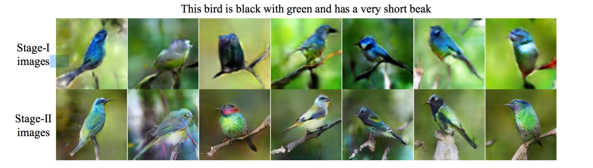
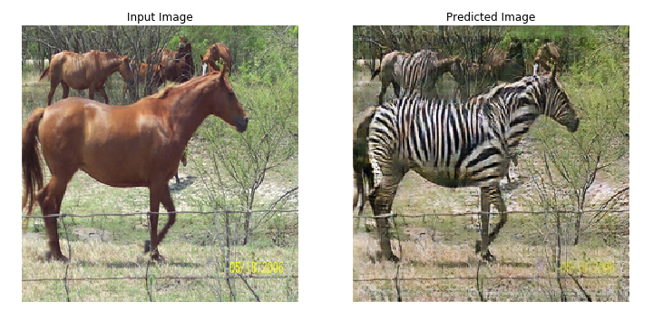
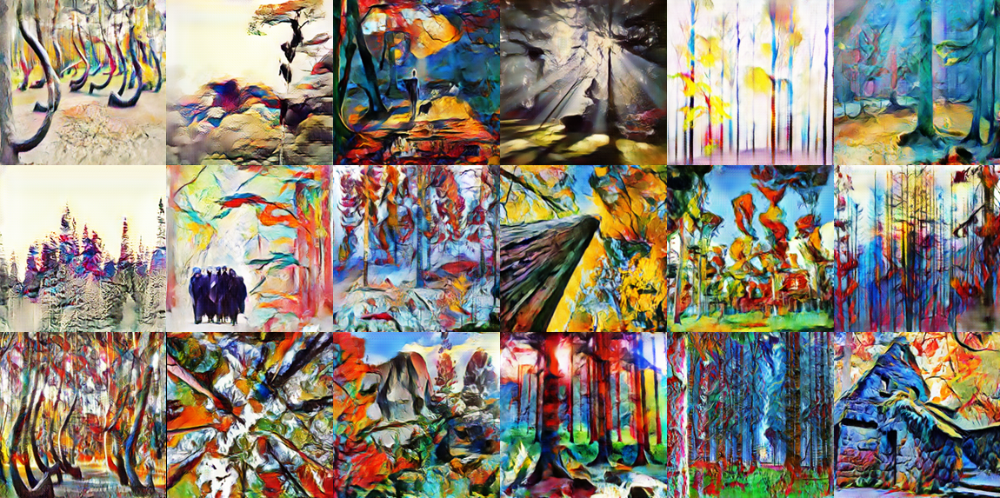
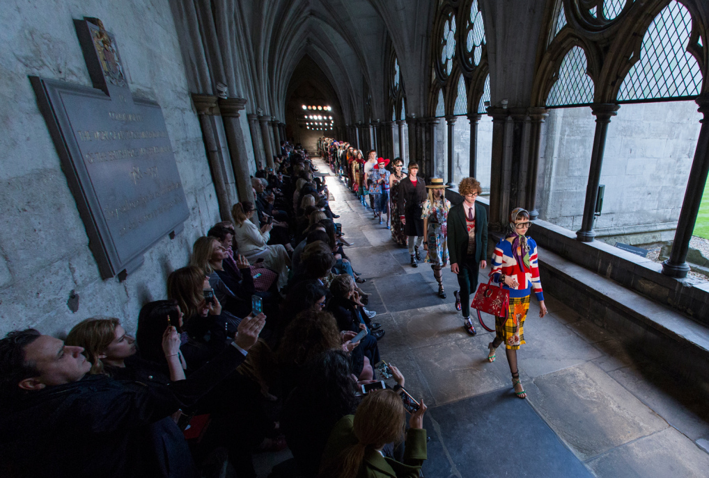

# GANs in Industry

> *"Everything you can imagine is real."* 
>
>  **Pablo Picasso**

## Introduction to Generative Modeling

To explain Generative Modeling in layman's terms lets think of a scenario where our model is a classifier and given an image the model classifies it into a cat or dog image, now what if we want this process to go in the opposite direction where we provide a prescription of what we want to our model and model generates an image corresponding to that prescription, that is a   *generative model* in its simplest form.

Let us assume a dataset with data instances *x* and its corresponding label as *y* then there can be two types of modeling:

- Discriminative Modeling: It captures conditional probability p(*y|x*)
- Generative Modeling: It captures joint probability P(*x*,*y*) if its supervised learning otherwise P(*x*).

  

  
<i>(A simple illustration of how one can use discriminative vs generative models, img src:<a>researchgate.net</a>)</i>

In the case of generative modeling, the distribution p(*x*) is being learned and represented in latent space(*z*), latent space is a hidden representation of data point using which we try to generate *x'*, this latent space *z* is learned representation which acts as inspiration so that we do not always get same *x'* as output.   

We humans also do something similar to it, lets take a scenario of reading a novel where *x* is the actual message author wants to convey different human being will have different interpretations *z* (unique hidden representation learnt by a human brain) and thus using these interpretations they will create their own understanding of author's work *x'*. 

 ## What is a GAN

> <i>" Adversarial training is the most interesting idea in the last 10 years in ML" </i>
>
> <b>Yann LeCun, the chief AI Scientist at Facebook</b> 

Machine learning algorithms work great in recognizing patterns in existing data and using that insight for classification and regression purposes, however machine always struggled when asked to generate new data.                                                                                This all changed in 2014 when Ian Goodfellow introduced Generative Adversarial Networks (GANs) to the world of machine learning, this technique enabled machines to generate realistic data.

GANs are the class of ML techniques that consist of two simultaneously trained neural networks, one is Generator which is used to generate the fake data and other is Discriminator which is used to classify whether input given to it is real (image from training dataset) or fake (generated by the discriminator).

The word <i>generative</i> in GAN indicates its sole purpose of generating new data, data that we want to generate depends on which dataset we have trained our GAN on. For example if we want to generate artwork similar to that of Pablo Picasso we will use his artwork as training dataset to train the GAN.

The word <i>adversarial</i> refers to the game like competition between Generator and Discriminator where Generator tries to beat Discriminator by fooling it using its generated fake image in our example it means producing artwork exactly similar to that of Pablo Picasso's whereas Discriminator objective is to discern the fake generated artwork from real.

Finally the word <i>network</i> is used to indicate the class of ML technique that is used to represent Generator and Discriminator: Neural Networks.				

 ## GAN Architecture

<i>(This figure illustrates architecture of GAN)</i>

Let's discuss details of the architecture:

1. <i>Training Dataset</i>(x): The dataset that we want the Generator to learn from, it contains set of real examples. This dataset acts as input to discriminator network
2. <i>Random Noise Vector</i>(z): This acts as raw input to the Generator network,Generator uses it as starting point for synthesizing fake examples.
3. <i>Generator network</i>: It is a neural network which takes (z) as input and outputs fake examples (x*). Its goal is produce fake examples which are indistinguishable from the real examples.
4. <i>Discriminator network</i>: It is a neural network which takes as input either real examples (x) or fake examples (x*) generated using Generator.
5. <i>Iterative training</i>: Using classification error of Discriminator we iteratively tune the Discriminator and Generator networks through backpropagation.					

 ## Training a GAN

As we discussed earlier the term  <i>adversarial</i> in GAN indicates the competitive dynamic between Generator and Discriminator,  therefore,  training a GAN includes simultaneous training of two different networks. The equilibrium state of GAN is defined as a NASH Equilibrium, it is a state when the discriminator is no longer able to classify between real data and fake data anymore(p(x)=0.5, p(x*)=0.5), in short, there is no room for more improvement left, and hence the training converges.

### Training the Discriminator network 

<b>a.</b> Take a random real example x from the training dataset.                                                                       

<b>b.</b> Pass random noise vector z as input to generator network and generate fake example x *.                                               

<b>c.</b> Classify x and x * using Discriminator network.                             

<b>d.</b> Compute the classification error and backpropagate the total error to update the Discriminator weights and biases, seeking to minimize the classification errors.

### Training the Generator network

  

<b>a.</b> Using random noise vector z as a input to the Generator network, synthesize a fake example x *.

<b>b.</b> Use the Discriminator network to classify x *.

<b>c.</b> Compute the classification error and backpropagate the error to update the Generator weights and biases, seeking to maximize the Discriminator’s error.

 ## Types of GAN
 ###  Deep Convolutional GAN(DCGANs)

Instead of simple feed-forward neural networks, in case of DCGANs both our Generator and Discriminator is implemented as convolutional neural networks(CNNs). This architecture achieves superior performance in image-processing tasks. Although without breakthroughs such as batch normalization, DCGAN would fail to train properly.

 ### Conditional GANs

The Conditional GAN (CGAN) is one of the first GAN innovations that made targeted data generation possible. It is a GAN whose Generator and Discriminator are conditioned during training by using some additional information such as a class label, a set of tags, or even a written description.

During training process the Generator learns to produce realistic images corresponding to each label in the training dataset, and the Discriminator learns to distinguish fake example-label pairs from real example-label pairs

**CGAN Generator**

Using random noise vector z and label y as inputs, the Generator produces a fake example x*|y that strives to be a realistic-looking match for the label.

**CGAN Discriminator**

The CGAN Discriminator receives real examples along with their labels (x, y) and fake examples along with the label used to synthesize them (x*|y, y). The Discriminator then outputs a probability (computed by the sigmoid activation function) indicating whether the input pair is real rather than fake.

 ### StackGANs

It is used to synthesize high-quality images from text descriptions, the main idea behind StackGANs is to decompose the hard problem into more manageable sub-problems using the sketch-refinement process.

The Stage-1 GAN generates the primary shape and colors of the object based on the given text description. The Stage-2 GAN takes Stage-1 results and text description as input and generates high-quality images corresponding to the text description. 

<i>(img source: Text to Photo-Realistic Image Synthesis by Vishal V, GitHub, <a>https://github.com/Vishal-V/StackGAN</a>)
</i>

 ### CycleGANs

The CycleGAN is used for image-to-image translation which involves generating a new synthetic version of a given image with a specific modification, for example transforming horse image into image of zebra.

CycleGAN is a technique that involves the automatic training of image-to-image translation models without paired examples. It is an unsupervised learning technique which requires collection of images from the source and target domain that do not need to be related in any way.

<i>(Transforming horse image into zebra image, src:<a>tensorflow.org</a>)</i>

 ### Disco GANs

As its name suggests **Discover Cross-Domain Relations GAN** (DiscoGAN), it learns to discover relations between different domains. Using the discovered relations, the network transfers style from one domain to another.

<i>( image source: <a>https://arxiv.org/pdf/1703.05192.pdf </a>)</i></i> 

 ## GANs in Art Industry

In 2018 AI-made portrait was sold at Christie's auction for nearly half a million dollars and you will be surprised to know that a Picasso went for the same price. Fascinating as it sounds! It was made by the team called Obvious and they used *none other than* **GANs**.

<i>(Pierre Fautrel, co-founder of the team of French entrepreneurs called Obvious, which produces art using artificial intelligence, stands next to "Edmond de Belamy, from La Famille de Belamy.")

source: <a>https://www.cnet.com/news/ai-made-portrait-sells-at-christies-auction-for-432500/</i>

From portraits to abstract arts GANs can create anything. GAN has a bright scope in the field of Art and content creation. GANs can be used for recognizing the style of an art piece and then perfectly creating new original art by mimicking the style of the art piece.

There is another fascinating project where we use GAN to create abstract art,  [GANGogh](https://github.com/rkjones4/GANGogh), where GAN is trained on a huge dataset of artistic works with different styles. Thus GAN generates art pieces by mixing those styles.

<i>Sample artwork using GANGogh</i> 

 ## GANs in Health Care 

GANs are utilized in improving diagnostic accuracy, before GANs were introduced Machine learning applications in health diagnosis  faced a range of challenges, one of the challenges was to procure training datasets that are large enough to train supervised  ML models due to difficulties involved in collecting medical data. The medical dataset is harder to come by, and they often require specialized equipment to collect. We have semi-supervised learning that helps to address the problem of small labeled datasets, this, however, addresses only half of the problem as in the case of semi-supervised learning we have a large dataset where only a small portion of the dataset is labeled, in healthcare applications this small portion is only data we have! For this problem, one of the solutions is to use standard data-augmentation techniques but using data-augmentation yields examples that do not diverge far from the original example and in the case of medical diagnostics, we want different examples of the same underlying pathology.

Here comes GAN in the picture where it can be utilized to produce **synthetic data** to enlarge a training dataset. But GANs themselves need a lot of data to train, for this problem researchers brought an ingenious solution. First, they have used the standard data-augmentation techniques to create a larger dataset, and then they used this dataset to train a GAN to generate synthetic examples. This process further enriched the available dataset beyond standard data-augmentation techniques.

Using GAN's capability to synthesize high-quality images to enlarge the training dataset, in 2018 [Frid-Adar](https://arxiv.org/abs/1803.01229)  decided to use GAN for medical data augmentation to improve the classification of liver lesions. The following chart shows their result:

<i>(This chart shows classification accuracy as new data is added on existing dataset using standard data-augmentation process and synthetic data generated using GAN. Source: Frid-Adar ., 2018, <a> https://arxiv.org/abs/1803.01229</a> )
</i>

## GANs in Fashion Industry

Unlike healthcare, for which we faced the challenge of procuring training data, researchers in fashion industries are fortunate to have a huge training dataset. Retail giants such as Amazon and Flipkart have data on millions of purchases of every fashion item from hats to shoes, and sites such as Instagram and Pinterest have countless images of outfits. Such data availability provides an open room for AI researchers.

 

In 2017 retail giant Amazon using GAN developed an AI Fashion Designer, the story, published in [MIT Technology Review](https://www.technologyreview.com/2017/08/24/149518/amazon-has-developed-an-ai-fashion-designer/ ), which only provided limited details about the project besides the mention of using GAN to design new customer-specific outfits. 

Also, using DiscoGANs one can utilize relation between different domains to perform a Style Transfer, if one wants to generate matching pair of shoes to their jacket, Style Transfer can do that.

 ## Few other Industrial Use Cases

### Gaming Industry

>  <b>What if we could train an AI model to draw new worlds based on video from the real world ?</b> 

In 2018 Nvidia presented a new GAN-based AI technology at the NeurIPS conference that can automatically generate realistic virtual worlds.

The below video features their work where the virtual world is not created by a graphics engine but rendered by a technology built by Nvidia by training a neural network on videos of cities to render urban environments.

These interactive 3D virtual worlds can be utilized by the gaming industries to make games whose experience is nothing compared to the games that we play today, games like GTA5 which is entirely based on the 3D virtual world can utilize this tool to maximize user experience.

<iframe width="560" height="315" src="https://www.youtube.com/embed/ayPqjPekn7g" title="YouTube video player" frameborder="0" allow="accelerometer; autoplay; clipboard-write; encrypted-media; gyroscope; picture-in-picture" allowfullscreen></iframe>

### Generating Music

It is of no surprise that GANs can be utilized to compose music, whenever there is room for creativity one can surely apply GAN. In 2016, [Olof Mogren](https://arxiv.org/pdf/1611.09904.pdf) presented a paper where he proposed a GAN that can work well on continuous sequential data, he introduced C-RNN-GAN where discriminator and generator are two different deep recurrent neural networks, he trained this model on a collection of classical music. The resulting model generated music, here I have added a sample of music that his model has generated.

<audio controls>
  <source src="c-rnn-gan-sample.mp3" type="audio/mpeg">
Your browser does not support the audio element.
</audio>

<audio controls>
  <source src="c-rnn-gan-sample11.mp3" type="audio/mpeg">
Your browser does not support the audio element.
</audio>

<i>source: Olof Mogren, <a>http://mogren.one/publications/2016/c-rnn-gan/</i></a>

### Drug Discovery and Development

While most researchers have used GANs to work with image, video, and speech, few researchers from [Insilico Medicine](https://insilico.com/) have proposed a method to use GAN in drug discovery and development. As there are already existing drugs for a certain disease, using this we can have a Generator network to sample drug candidates for that disease that can be as effective as real ones.

### Generating Website designs

Designing a website is a manual process that requires creative thinking and a lot of hard work as it is a skilled process. But again whenever there is room for creativity one can surely apply GAN. GAN can be utilized to design websites, once GAN is trained on various website designs it can come up with an initial design of a website, this initial design can be a great help to designers.

### Creating Infographics 

Infographics are used as a powerful tool to convey information easily through the use of visual data and statistics. It requires a lot of hard work to design an Infographic it consists of planning the infographic design, selecting the right infographic layout, incorporating different Infographic design elements, and many more. GANs can help the designers to come up with a new unique design by sampling existing designs, this generated design can act as an inspiration to a designer. 

 ## Drawbacks

- While discussing the training of GAN I have used a term called *Nash Equilibrium*, which is a condition where the discriminator is no longer able to classify between real data and fake data anymore. Achieving a *Nash Equilibrium* while training a GAN is very difficult, thus, training of GAN is highly unstable and its convergence may often fail.
- If the data that we have is highly complex and has multi-modal distribution, GAN will not be able to represent it. This issue restricts GAN's ability to produce diverse results.
