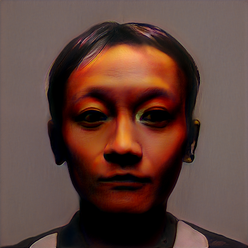

# GANArt: Using AI to create Portraits


> This blog is about my project **‘GANArt: Using AI to create Portraits,’** for which I have used various public domain portraits between 1750 to 1950 to train the AI model. The model then adapts the art style and then generates new unique portraits on its own.

GAN(Generative Adversarial Network) is no wonder an amazing discovery in the field of Deep Learning. From generating fake human faces to an entirely new virtual world, if there is room for creativity, one can indeed implement GAN. This fascination of mine towards Generative Modelling, and in particular GAN, led me towards this creative project.        

There are many works already where people have applied GAN in the field of Arts, from abstract arts to genre-specific paintings(using <i>Conditional GANs</i>), and some of these works inspired me to dig deeper into the field of GAN.

For this project, I have used Nvidia's [StyleGAN2 ADA model](https://arxiv.org/pdf/2006.06676.pdf), StyleGAN2 is an upgraded version of its earlier model [StyleGAN](https://arxiv.org/pdf/1812.04948.pdf), as we know training a GAN using too little data typically leads to discriminator overfitting, causing training to diverge, and therefore, Nvidia came up with the idea of adaptive discriminator augmentation (ADA) and solved the issue of discriminator overfitting.

You can find the Github repository for this project [here](https://github.com/DeewakarChakraborty/GANArt-Using-AI-to-create-Portraits).

## Data Collection

The first and foremost challenge for such a project is to collect the training data. For this, I have scrapped data from [Wikiart](https://www.wikiart.org/). It is an online, user-editable visual art encyclopedia. I have scrapped only those paintings which are available in the public domain to avoid copyright infringement. For data scrapping, I have used the [Beautiful Soup](https://www.crummy.com/software/BeautifulSoup/bs4/doc/) library. I have picked almost all the paintings between 1850 to 1950 under the category of *Portraits* and *Self-Portraits*.

I have uploaded the scrapped data on kaggle. Here is the [link](https://www.kaggle.com/deewakarchakraborty/portrait-paintings) for the dataset.

Few sample paintings from the dataset.

<center>


</center>

##  Data Preprocessing

Once data has been scrapped, all we need to do is to preprocess it. All the images that have been scrapped will have different aspect ratios and resolutions, which we have to make uniform before feeding it to the model. Also, most of the paintings have frames at their borders which we need to remove.

### Preprocessing  the  paintings

So for this project, I have decided the resolution of generated portrait to be 512 X 512, but all the scrapped paintings will have different resolutions. Thus, we need to ensure that all the input paintings are to the model of uniform resolution 512 X 512. Following is the code snippet for preparing images:

```python
# Importing necessary libraries
import os
from PIL import Image
import numpy as np

from_path = 'art/cropped/' #directory of scrapped paintings 
to_path = 'art/resized/'   #directory of resized paintings

size = 512 #Required resolution

path, dirs, files = next(os.walk(from_path))
for file in sorted(files):
  image = Image.open(path + "/" + file)
  if image.mode == "RGB":
    image_resized = image.resize((size,size), resample=Image.BILINEAR)
    image_resized.save(to_path + "/" + file) #Saving the resized images 
```

<center>


<i> (After resizing the images, all images are of  </i>512 X 512 <i>resolution.) </i>

</center>

### Performing Data Augmentation

After performing initial scrapping, I have fetched around 1100 paintings. Therefore, to increase the volume of training data, I have performed some data augmentation on scrapped paintings. For data augmentation, I have used the [imgaug](https://imgaug.readthedocs.io/en/latest/) library. Following is the code snippet for data augmentation:

```python
from imgaug import augmenters as iaa

num_augmentations = 2 #Number of augmentations that I want

#Image Augmenter
seq = iaa.Sequential([
    iaa.Fliplr(0.5),
    iaa.PerspectiveTransform(scale=(0.0, 0.2), mode='replicate'),
    iaa.AddToHueAndSaturation((-20, 20))
])
```

The reason behind using the number of augmentations as 2 is just heuristics. I have used the StyleGAN2 ADA model, this model has adaptive discriminator augmentation that will take care of further necessary augmentation.

### Transforming images into TF.Records

One another step in pre-processing is to transform the images into TF.records(creating the dataset). Again, Nvidia’s StyleGAN2 has an inbuilt option to create the dataset. First and foremost, we have to make sure we are using the TensorFlow 1.x version because Nvidia continued using this version of the TensorFlow.

```python
%tensorflow_version 1.x
```


Following is the code snippet for creating the dataset:

```python
#First of all we have to clone Nvidia's StyleGAN2 repo
%cd "/content/drive/My Drive/Project" #directory of my project
!mkdir colab-sg2-ada
%cd colab-sg2-ada
!git clone https://github.com/dvschultz/stylegan2-ada

#command for creating dataset
!python dataset_tool.py create_from_images "/content/drive/My Drive/Project/Images" '/content/drive/My Drive/Project/Dataset'
```


## Training the model

Once we have the dataset, the next task is to train the model using the dataset. I have used Nvidia’s [StyleGAN2 ADA](https://arxiv.org/pdf/2006.06676.pdf) model. StyleGAN is one of the most popular generative models by NVIDIA. Multiple versions of StlyeGAN have been released, and I have used the latest version, StyleGAN2-ADA. Training StyleGAN is computationally expensive; therefore, I have used Google colab pro to train the model. It took roughly two days to train the model. To train this model, make sure you are inside the directory of the cloned repository.

Now, for training, we have to set specific hyperparameters. 

```python
#how often should the model generate samples and a .pkl file
snapshot_count = 10
#should the images be mirrored left to right?
mirrored = True
#should the images be mirrored top to bottom?
mirroredY = False
#metrics? 
metric_list = None
#augments
augs = "bg"
```

Note that if your GPU is not that powerful, keep snapshot_count as minimum as possible(for, e.g., 5) and keep the metric_list as none. Now once you have set the hyperparameters, you can start the training process.

```python
!python train.py --outdir='/content/drive/MyDrive/Kaggle/Portrait/Results' --snap=snapshot_count  --data='/content/drive/MyDrive/Kaggle/Portrait/Dataset_TF' --augpipe=augs --mirror=mirrored  --mirrory=mirroredY --metrics=metric_list 
```

Now, once training has started, a new folder will be created inside the folder Results(in my case), and after every ten ticks, a .pkl will be saved there to represent the trained model.

<b>When to stop training?</b>

There is no specific metric to judge the training when it comes to Generative Modelling. What I did, was to check after every few hours the status of the snapshot. the training process yields the output of the model along with saving its .pkl file. I kept checking the output, and when it finally started to resemble the portraits after a day or two, I stopped the training process as training further was not improving the output anymore.

## Generating Portraits

Now once you have trained the model, it is ready to generate portraits on its own. All you have to do is provide the random seed values to the generator. The generator will then produce portraits based on the given seed values.

```python
!python generate.py generate-images --network='/content/drive/MyDrive/Kaggle/Portrait/Results/final_model.pkl' --seeds=6600-6625 --outdir='/content/drive/MyDrive/Kaggle/Portrait/Output'
```

In this case, I have provided seed values from 6600-6625. This will generate 25 portraits.

Some of the generated portraits.

<center>


</center>

## Use of  Transfer Learning

Once I finished training the model, I also tried the approach of Transfer Learning. Firstly I collected some random human faces that don't exist. Once the dataset was ready, I used the trained model as a starting point and fine-tuned the model. Following are some sample portraits generated by the transfer learning model.




## Some Interesting Incidents

So somewhere in between the training process, I found out a bizarre incident. Even though there were no paintings related to Jesus Christ in the dataset, it turns out in between the training process; there was a generated portrait resembling Jesus during the training process. GAN's can be very interesting, but at the same time, they can produce unexplainable outcomes.

<center>


</center>

## Acknowledgement 

- ‘GANs in Action’ by Jakub Langr and Vladimir Bok.
- MachineRay: Using AI to create Abstract art by [Robert A. Gonsalves](https://github.com/robgon-art)


